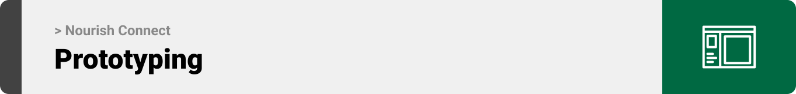
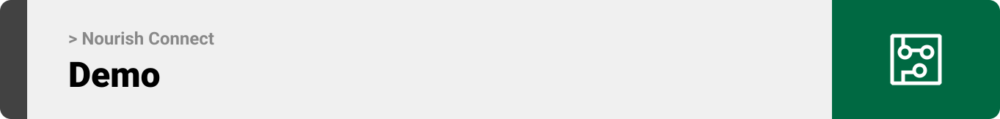
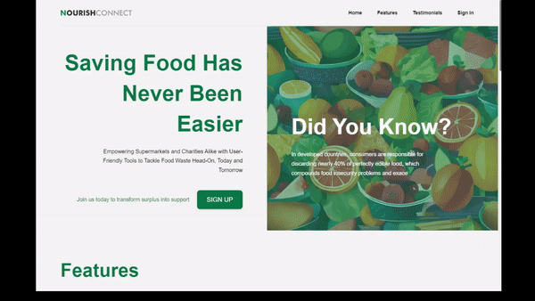
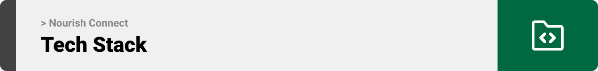

<div align="center">

> Hello, world! This is the project’s summary that describes the project plain and simple, limited to the space available. 


**[PROJECT PHILOSOPHY](#project-philosophy) • [PROTOTYPING](#Prototyping) • [TECH STACK](#tech-stack) • [IMPLEMENTATION](#implementation) • [HOW TO RUN?](#how-to-run)**

</div>
<br><br>

<!-- project philosophy -->

<a id="project-philosophy"></a>

> Nourish Connect is a website dedicated to tackling the pressing issue of food waste in supermarkets while fostering stronger connections between communities and charitable organizations.
>
> Our philosophy revolves around the principles of sustainability, efficiency, and social impact. We envision a world where no edible food goes to waste, and every surplus item can nourish those in need.

### Supermarkets User Stories
- As a supermarket manager, I want to sales data in real-time so that I can make informed decisions about surplus food items.
- As a supermarket manager, I want AI-generated suggestions on which items to donate to local charities to minimize food waste and maximize social impact.
- As a supermarket manager, I want to view a dashboard summarizing donation data, weekly revenue, and top products to monitor the positive environmental and social impact of my store.
### Charities User Stories
- As a representative of a local charity, I want to post requests for specific food donations on the platform and track the status of these requests in real-time. This ensures that our organization receives the items needed to support our community efficiently and allows us to coordinate effectively with supermarkets.
- As a charity, I want to easily communicate and coordinate with supermarket managers to schedule food pickups and streamline the donation process.

### Cashiers User Stories
- As a cashier, I want a user-friendly point-of-sale system integrated into the platform, making it easy for me to update inventory data and reduce errors.
- As a cashier, I want the option to upload inventory data by filling out a form or by uploading CSV/XLSX files, ensuring accurate inventory management.

<br><br>

<!-- Prototyping -->

<a id="Prototyping"></a>
> We designed Nourish Connect using wireframes and mockups, iterating on the design until we reached the ideal layout for easy navigation and a seamless user experience.


### Mockups
#### Auth Screens
| Sign up 1 | Sign up 2 |
| ---| ---| 
|  |  | 

| Sign up 3 | Sign in |
| ---| ---|
|  |  | 

#### Manager Screens
| Dashboard | Cashiers |
| ---| ---|
|  |  | 

| Donations | Discounts |
| ---| ---|
|  |  | 

| Charities Map | Chat |
| ---| ---|
|  |  | 

#### Charity Screens
| Requests Overview | Chat |
| ---| ---|
|  |  | 

#### Cashier Screens
| Point Of Sales | Inventory |
| ---| ---|
|  |  | 


<br><br>

<!-- Implementation -->

<a id="implementation"></a>

> Using the wireframes and mockups as a guide, we implemented Nourish Connect website with the following features (These are GIFs recorded from the real website):

### Landing Page




### Auth Screens (Web)
| Sign up | Sign in |  
| ---| ---| 
|  |  |
### Manager Screens (Web)
| Dashboard  | Cashiers screen |  
| ---| ---| 
|  |  |

|  Donations Screen | Discounts screen  |
| ---| ---| 
 |  |

| Chats Screen (Supermarket mangers & Charities) | Map Screen |
| ---| ---| 
|  |  |

### Charity Screens (Web)
| Donations Overview Screen | Chats Screen (Supermarket mangers & Charities) |
| ---| ---| 
|  |  |

### Cashier Screens (Web)
| Point Of Sales Screen  | Inventory screen |  
| ---| ---| 
|  |  |

<br><br>

<!-- Tech stack -->

<a id="tech-stack"></a>

###  Nourish Connect is built using the following technologies:

- Nourish Connect uses the [React](https://reactjs.org/) library for its frontend development. React is known for its flexibility and efficiency in building dynamic user interfaces.
- The backend of Nourish Connect is powered by the [Laravel framework](https://laravel.com/). Laravel is a popular PHP framework known for its elegant syntax and robust features for web application development.
- The project uses a SQL database for data storage and management. SQL databases are well-suited for structured data and provide strong data consistency.
- Nourish Connect incorporates real-time chat functionality using [Firebase](
https://firebase.google.com/). Firebase is a comprehensive platform that offers real-time database capabilities, making it ideal for chat applications.
- To enable real-time updates, the project leverages the [Pusher](https://pusher.com) service for WebSocket functionality. Websockets ensure instant data synchronization between different users and components of the application.
- Nourish Connect utilizes [Node.js](https://nodejs.org/en) for handling endpoints that trigger WebSocket events. Node.js is known for its non-blocking, event-driven architecture, making it suitable for real-time applications and API endpoints.


<br><br>

<!-- How to run -->

<a id="how-to-run"></a>
> To set up Nourish Connect locally, follow these steps:

### Prerequisites

This is an example of how to list things you need to use the website and how to install them.

* npm
  ```sh
  npm install npm@latest -g
  ```

### Installation

1. **Open your XAMPP control panel and start Apache and MySQL**
2. **Clone the Repository**
   - Get the source code by cloning the Nourish Connect repository.
     ```sh
     git clone https://github.com/JaafarMortada/Nourish-Connect.git
     ```

3. **Frontend Setup**
   - Navigate to the frontend directory:
     ```sh
     cd Nourish-Connect/Client
     ```
   - Install npm packages:
     ```sh
     npm install
     ```
   - Change `.env.example` to `.env`. Then add your Pusher credentials:
     ```env
     VITE_PUSHER_APP_ID=YOUR_PUSHER_APP_ID
     VITE_PUSHER_APP_KEY=YOUR_PUSHER_APP_KEY
     VITE_PUSHER_APP_SECRET=YOUR_PUSHER_APP_SECRET
     VITE_PUSHER_APP_CLUSTER=YOUR_PUSHER_CLUSTER
     ```

4. **Backend Setup**
   - Navigate to the backend directory:
     ```sh
     cd ../Server
     ```
   - Install composer packages:
     ```sh
     composer install
     ```
   - Change `.env.example` to `.env`. Then add your ForgeAI API (Visit [TheForgeAI](https://theforgeai.com/) and create your app to get the free API key) key and specify your database name:
     ```env
     FORGE_KEY=YOUR_FORGE_KEY
     DB_DATABASE=YOUR_DATABASE_NAME
     DB_USERNAME=
     DB_PASSWORD=
     ```
   - Run the following commands
     ```sh
     php artisan key:generate
     php artisan storage:link
     ```
   - Migrate the database schema
     ```sh
      php artisan migrate
     ```
   - Generate a secret key to handle token encryption 
     ```sh
      php artisan jwt:secret
     ```
   
5. **Node.js Server Setup**
   - Navigate to the websockets-server directory:
     ```sh
     cd ../websockets-server
     ```
   - Install npm packages:
     ```sh
     npm install
     ```
   - Change `.env.example` to `.env`. Then add your Pusher credentials:
     ```env
     PUSHER_APP_ID=YOUR_PUSHER_APP_ID
     PUSHER_APP_KEY=YOUR_PUSHER_APP_KEY
     PUSHER_APP_SECRET=YOUR_PUSHER_APP_SECRET
     PUSHER_APP_CLUSTER=YOUR_PUSHER_CLUSTER
     ```

6. **Start the Application**
   - Start the Laravel backend server (in the Server directory):
     ```sh
     php artisan serve
     ```
   - Start the Node.js server for real-time features (in the websockets-server directory):
     ```sh
     node index.js
     ```
   - Start the Vite development server for the frontend (in the Client directory):
     ```sh
     npm run dev
     ```

7. **Access the Application**
   - Open your web browser and navigate to `http://localhost:5173` to access Nourish Connect.

Now, you should be able to run Nourish Connect locally and explore its features.