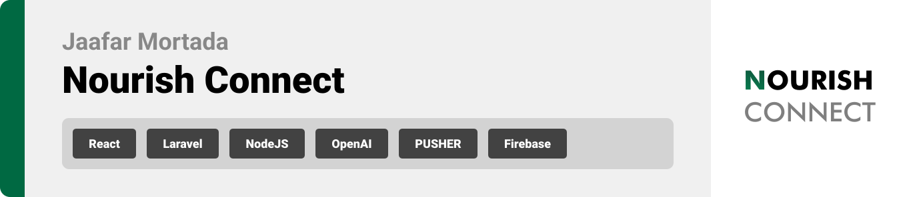

<div align="center">

> Hello, world! This is the project’s summary that describes the project plain and simple, limited to the space available. 


**[PROJECT PHILOSOPHY](#project-philosophy) • [PROTOTYPING](#Prototyping) • [TECH STACK](#tech-stack) • [IMPLEMENTATION](#implementation) • [HOW TO RUN?](#how-to-run)**

</div>


<br><br>

<!-- project philosophy -->

<a id="project-philosophy"></a>

> Nourish Connect is a website dedicated to tackling the pressing issue of food waste in supermarkets while fostering stronger connections between communities and charitable organizations.
>
> Our philosophy revolves around the principles of sustainability, efficiency, and social impact. We envision a world where no edible food goes to waste, and every surplus item can nourish those in need.

### Supermarkets User Stories
- As a supermarket manager, I want to sales data in real-time so that I can make informed decisions about surplus food items.
- As a supermarket manager, I want AI-generated suggestions on which items to donate to local charities to minimize food waste and maximize social impact.
- As a supermarket manager, I want to view a dashboard summarizing donation data, weekly revenue, and top products to monitor the positive environmental and social impact of my store.
### Charities User Stories
- As a representative of a local charity, I want to post requests for specific food donations on the platform and track the status of these requests in real-time. This ensures that our organization receives the items needed to support our community efficiently and allows us to coordinate effectively with supermarkets.
- As a charity, I want to easily communicate and coordinate with supermarket managers to schedule food pickups and streamline the donation process.

### Cashiers User Stories
- As a cashier, I want a user-friendly point-of-sale system integrated into the platform, making it easy for me to update inventory data and reduce errors.
- As a cashier, I want the option to upload inventory data by filling out a form or by uploading CSV/XLSX files, ensuring accurate inventory management.

<br><br>

<!-- Prototyping -->

<a id="Prototyping"></a>
> We designed Nourish Connect using wireframes and mockups, iterating on the design until we reached the ideal layout for easy navigation and a seamless user experience.


### Mockups
| Sign up | Sign up |
| ---| ---| 
|  |  | 

| Sign up  | Sign in |
| ---| ---|
|  |  | 

<br><br>

<!-- Implementation -->

<a id="implementation"></a>

> Using the wireframes and mockups as a guide, we implemented the Coffee Express app with the following features:

### Landing Page


### Manager Screens (Web)
| Dashboard  | Cashiers screen |  
| ---| ---| 
|  |  |

|  Donations Screen | Discounts screen  |
| ---| ---| 
 |  |

| Chats Screen | Map Screen |
| ---| ---| 
|  |  |

<br><br>

<!-- Tech stack -->

<a id="tech-stack"></a>

###  Coffee Express is built using the following technologies:

- Nourish Connect uses the [React](https://reactjs.org/) library for its frontend development. React is known for its flexibility and efficiency in building dynamic user interfaces.
- The backend of Nourish Connect is powered by the [Laravel framework](https://laravel.com/). Laravel is a popular PHP framework known for its elegant syntax and robust features for web application development.
- The project uses a SQL database for data storage and management. SQL databases are well-suited for structured data and provide strong data consistency.
- Nourish Connect incorporates real-time chat functionality using [Firebase](
https://firebase.google.com/). Firebase is a comprehensive platform that offers real-time database capabilities, making it ideal for chat applications.
- To enable real-time updates, the project leverages the [Pusher](https://pusher.com) service for WebSocket functionality. Websockets ensure instant data synchronization between different users and components of the application.
- Nourish Connect utilizes [Node.js](https://nodejs.org/en) for handling endpoints that trigger WebSocket events. Node.js is known for its non-blocking, event-driven architecture, making it suitable for real-time applications and API endpoints.


<br><br>

<!-- How to run -->

<a id="how-to-run"></a>
> To set up Coffee Express locally, follow these steps:

### Prerequisites

This is an example of how to list things you need to use the software and how to install them.
* npm
  ```sh
  npm install npm@latest -g
  ```

### Installation

_Below is an example of how you can instruct your audience on installing and setting up your app._

1. Get a free API Key at [https://example.com](https://example.com)
2. Clone the repo
   ```sh
   git clone https://github.com/your_username_/Project-Name.git
   ```
3. Install NPM packages
   ```sh
   npm install
   ```
4. Enter your API in `config.js`
   ```js
   const API_KEY = 'ENTER YOUR API';
   ```

Now, you should be able to run Nourish Connect locally and explore its features.